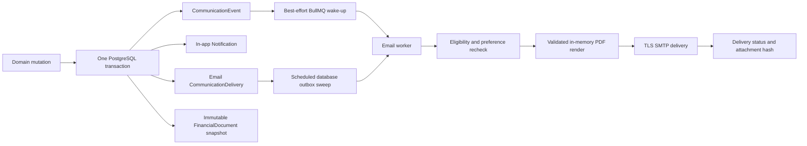

# Communications, Email, and Financial Documents

This document is the durable engineering and operations contract for
GuestPost.cc notifications, transactional email, user preferences, and PDF
financial-document attachments. Code remains the source of truth; the primary
catalog is `packages/shared/src/communications.ts` and the attachment policy is
`packages/shared/src/financial-documents.ts`.

## Architecture



The database, not Redis, is the delivery boundary. The domain mutation,
logical event, recipient deliveries, in-app notification, and any financial
document snapshot commit together. Queue publication only reduces latency. A
five-minute sweep recovers committed deliveries after queue or worker outages.

### Transaction and dispatch boundary

Every API communication write and its recipient lookup must receive the
authoritative interactive transaction client. `CommunicationsService` rejects
the root Prisma client at runtime and has no default database argument. A
domain transition, audit row, communication event, in-app notification, email
delivery, and financial-document snapshot therefore either commit together or
roll back together. Do not catch an outbox error inside the transaction and
commit the domain mutation without its required communication.

The transaction returns committed event IDs (or a stable dedup key when a
serializable retry can replace a rolled-back ID). Only after the transaction
promise resolves may the caller use `dispatchManyBestEffort`,
`dispatchByDedupKeyBestEffort`, or an equivalent worker wake-up. Queue failure
is non-fatal after commit because the database sweep remains authoritative.
Worker-originated email wake jobs are signed with the dedicated queue-signing
secret before they enter BullMQ; the email processor rejects unsigned or stale
payloads. Wake jobs use one BullMQ attempt because retry timing belongs to the
database delivery row. Their bounded retention is safe because the job ID also
contains the delivery attempt and `availableAt` state; a later database retry
therefore cannot be blocked by a retained completed/failed wake. Keep the
signing and state-bound job ID in any new raw BullMQ producer.
Provider transition cores expose in-transaction hooks for communications that
belong to their state change; opening a second transaction after such a core
returns is a split commit and is prohibited.

## Communication catalog and preferences

Every event must be declared in `COMMUNICATION_EVENT_TYPES` with a category,
severity, default channels, and deliberately narrow required-channel policy.
The API rejects unknown event types, unsafe action paths, oversized messages,
duplicate preference categories, and staff settings submitted by non-staff
users.

Customer, publisher, and staff settings support in-app and email control by
category. Required security, money-receipt, deadline, fraud, reconciliation,
and staff-risk channels override opt-outs. This exception must not be expanded
for marketing or product announcements.

Delivery fraud detection records a required `STAFF_FRAUD_ALERT` in the same
Order-locked transaction that appends the immutable fraud flag. The alert is
preference-resistant for staff risk recipients and contains only the order,
delivery, flag identity, and signal type. Investigation evidence and any
cross-order customer details remain in staff-authorized delivery evidence
surfaces. See `docs/DELIVERY_FRAUD_AND_MANUAL_VERIFICATION.md` for adjudication
and customer-denial behavior.

Recipient eligibility is evaluated twice: when the event commits and again
immediately before SMTP delivery. A deleted, banned, unverified, opted-out, or
suppressed recipient is not sent mail. Required messages still require an
eligible verified address.

An `actorUserId` is excluded from the resolved recipient list by default so an
activity broadcast does not echo back to its initiator. A transactional receipt
that must reach its initiator declares `actorRecipientPolicy:
INCLUDE_IF_LISTED` in the central communication catalog. That policy only
retains an actor already returned by the authorized recipient resolver; it
never adds a user, changes organization scope, or bypasses the normal banned,
verification, preference, or suppression checks. `ORDER_PAYMENT_CAPTURED` and
`ORDER_REFUNDED` declare this policy so every writer preserves the required
in-app financial notice, email, and invoice or credit-note attachment for a
sole-owner customer who initiated the transaction.

An outbox dedup key is not permission to reuse an existing event. After the
upsert wins, the writer compares the canonical immutable type, policy category
and severity, aggregate, organization, title, message, action, and stable JSON
payload before resolving any recipient. A collision fails the surrounding
domain transaction. Request IDs are tracing metadata and recipients are
repairable projections, so neither is part of immutable identity. Exact replay
may repair an independently authorized recipient; it cannot change tenant or
content. Event status reconciliation locks the parent event first and counts
all outstanding deliveries, including rows created by an older replay.

## Email security and rendering

- Dynamic content is HTML-escaped and every message has a plain-text part.
- Action destinations are application-relative paths resolved against the
  audience's allowlisted application origin. Production origins must be HTTPS.
- SMTP uses TLS 1.2 or later, bounded connection and socket timeouts, a small
  connection pool, deterministic message IDs, and bounded exponential retries
  only before dispatch has begun.
- Subjects reject CR/LF injection. Recipient addresses and optional staging
  domains are validated immediately before delivery.
- Logs contain delivery IDs, event types, recipient domains, and bounded
  redacted diagnostics - never full addresses, message bodies, provider
  payloads, invoice snapshots, or tax identifiers.
- SMTP 550, 551, and 553 responses create a hard-bounce suppression. Mailbox
  full and generic provider-policy errors remain retryable.
- `disabled`, `capture`, and `live` delivery modes are explicit. Production
  startup rejects a missing or invalid mode, and the processor independently
  falls back to `disabled` if startup validation is ever bypassed. Production
  `capture` requires a non-empty `EMAIL_ALLOWED_RECIPIENT_DOMAINS`; capture
  still uses its configured SMTP transport and does not redirect recipients.

## PDF attachment policy

Only these customer financial events currently produce attachments:

| Event | Document | Purpose |
| --- | --- | --- |
| `ORDER_PAYMENT_CAPTURED` | Paid invoice | Records a completed wallet-funded service purchase |
| `ORDER_REFUNDED` | Credit note | Records the reversal and references the original invoice when available |
| `BILLING_DEPOSIT_SUCCEEDED` | Deposit receipt | Records funds received and the amount credited to the wallet |

Settlement and payout messages are not called invoices. They remain
transactional statements until their accounting, withholding, and
jurisdictional requirements are separately certified. Staff risk alerts never
receive customer accounting attachments.

Events created before attachment support remain deliverable without a PDF.
New events store only a `financialDocumentId` in the communication payload. If
that ID is present but malformed, missing, the wrong kind, or bound to another
aggregate or organization, delivery fails closed and retries. The worker never
accepts arbitrary filenames, HTML-to-PDF input, remote images, filesystem
paths, or attachment bytes from an event payload.

PDFs are generated in memory with bundled font assets used for shaping and
vector primitives. They contain no JavaScript, forms, remote resources,
embedded files, or external links. The deterministic filename is the financial
document number, and the attachment is capped at 5 MiB. After SMTP acceptance,
the delivery stores the filename, byte size, and SHA-256 digest for forensic
comparison without retaining a second PDF copy.

Every email claim is fenced by its exact `(attempts, lockedAt)` pair. The worker
revalidates and renews that fence when it persists `dispatchStartedAt`,
immediately before SMTP. An expired pre-dispatch claim is safe to retry. An
expired or transport-ambiguous post-dispatch claim becomes
`DELIVERY_UNCERTAIN`; it remains outstanding and is never selected by the
automatic sweep, because generic SMTP cannot prove whether the remote server
accepted the deterministic message ID. Stale workers can neither overwrite a
replacement claim nor automatically cause a second financial email.
Terminal `SENT`, `BOUNCED`, and `SUPPRESSED` transitions lock the parent
`CommunicationEvent` before changing a delivery, then count outstanding rows
and finalize the event in that same transaction. This event-first lock order
serializes two final recipients so neither can strand the event as `PENDING`.
Lease recovery emits a PII-free structured error and Sentry incident whenever
it creates `DELIVERY_UNCERTAIN`; a crash-after-SMTP case is never silent.

## Accounting data and immutability

`BillingProfile` is mutable and owner-only. It contains the legal name,
billing email, postal address, country code, and optional paired tax-ID
type/value used for future documents. Reads and writes repeat active-owner
authorization inside the service even though the controller also uses role
guards. Audit entries record only the country and presence flags; addresses,
emails, and tax identifiers are excluded from audit metadata.

`FinancialDocument` is an issued accounting record. It receives a global
database sequence, snapshotted prefix, UTC issue time, exact decimal totals,
recipient and issuer snapshots, line items, payment reference, tax statement,
and optional original-document reference. A database trigger rejects UPDATE
and DELETE so later profile or environment changes cannot rewrite history.
Credit notes are new immutable records rather than edits to invoices. Document
issuance uses one parameterized insert targeted specifically at `ON CONFLICT
("dedupKey") DO NOTHING`, then reads and validates the winning immutable row.
Concurrent writers for that exact command converge without rolling back the
domain transaction. Other unique violations, including a different command
attempting a second document for the same kind/aggregate, are not swallowed. A
dedup key bound to different aggregate, organization, kind, currency, totals,
related document, or payment reference fails closed.

Before issuance, the source row supplies the canonical aggregate type and
organization (nullable only for personal-wallet deposits). The listed audience
must be a subset of the financial principals for that source and must include
the payer/creator: Order customer plus active organization owners, or deposit
creator plus active organization owners. A publisher or unrelated same-org
user cannot be attached to a customer PDF. Personal-wallet receipts use an
independently validated account name/email and fall back to the generic
`GuestPost.cc customer` identity when ordinary profile text is not invoice-safe.
Credit notes additionally bind to the exact `REFUND` ledger ID, amount,
currency, canonical wallet tenant, and refund event evidence; the immutable
payment reference is `Refund <transaction-id>`, never a mutable live Order
description.

Acceptance-timeout refunds keep the `ORDER_REFUNDED` financial audience to the
order customer and active customer-organization owners. Publisher members get
a separate non-financial `ORDER_CANCELLED` event scoped to the publisher's
canonical organization and never receive the customer credit note. Refund and
staff-risk payload amounts remain normalized decimal strings (for example,
`120.00`), never lossy JavaScript numbers. An exact prior timeout refund is
repairable only after validating
its REFUND ledger row, wallet tenant, amount, currency, responsibility, event,
the matching durable `REFUND_ISSUED` OrderEvent, and document. The narrowly
recognized pre-hardening credit note remains
immutable with its historical `Order <id>` reference; its pre-dispatch
publisher email is suppressed and its publisher in-app projection removed
before customer projections are repaired, and the locked parent event is
reconciled again after that cleanup. Any already-sent, uncertain, or
dispatch-started publisher delivery is preserved as incident evidence. The
immutable legacy recipient snapshot is issuance evidence; a later billing
profile or organization-name edit is not compared to that historical value.
An exact pre-hardening numeric staff-alert payload is likewise preserved after
full event/tenant/amount validation; all newly created alerts use exact decimal
strings.
The canonical API refund replay applies the same narrow grandfather to the
origin/main customer-refund event shape: it verifies terminal order and
`REFUND_ISSUED` evidence, the exact ledger reference/amount/currency/wallet,
event tenant/content/payload, document linkage/totals/schema, historical
`Order <id>` reference, and every existing projection's customer audience.
Only then can the shared event-locked projection helper restore a missing
required customer delivery. A mismatched document, tenant, recipient, or
payload fails without creating a second refund or replacing the issued record.

Document numbers use:

```text
{PREFIX}-{INV|CRN|DPR}-{UTC YEAR}-{8-DIGIT GLOBAL SEQUENCE}
```

Database sequences may contain gaps after rolled-back transactions. Gaps are
normal and must not be "repaired" by renumbering issued documents.

All monetary comparisons are performed using exact decimal/minor-unit logic.
Rendering stops before SMTP if any `unit amount * quantity` line total or the
line-total, subtotal, tax, and grand-total reconciliation fails, including for
valid values above JavaScript's safe-integer range. The current commerce model
does not separately charge tax, so the
document truthfully shows a zero tax amount and states that tax was not
separately charged. Do not change PDF wording to introduce VAT/GST/sales tax;
tax calculation, evidence, registration, and ledger behavior must be built and
certified first.

The worker loads deterministic OFL-licensed Noto TTF assets for Latin,
Cyrillic, Greek, Devanagari, Bengali, Arabic, Simplified Chinese, Japanese, and
Korean only when the snapshot needs those scripts. FontKit performs shaping;
the visible dynamic text is emitted as positioned vector glyph outlines using
its exact advances and X/Y offsets. This avoids two unsafe PDF text paths:
ordinary text operators cannot preserve every Arabic/Bengali positioning
offset, and FontKit's legacy CJK subset output can retain advances for missing
or corrupt outlines. No Noto/CID font is embedded in the resulting document.

Search and copy remain available through a Base14 Helvetica text-showing proxy
for each dynamic span, wrapped in PDF `/ActualText` containing the exact logical
rendered value. The proxy is transparent and horizontally sized to the visible
outline span; it never receives untrusted Unicode. Unsupported characters are
converted before both layers, so the visible `[U+CODEPOINT]` marker and
`/ActualText` always agree. This is a searchable accounting PDF, but it is not
claimed to be a fully structured PDF/UA document; release tests preserve raw
reading order and exact dynamic values with Poppler.

Mixed Arabic/Latin/digit text is resolved with Unicode Bidirectional Algorithm
levels while each RTL run stays logical for shaping. Machine-readable ASCII
identifiers and dates are internally LTR-isolated so a value such as
`2026-08-10` cannot become `10-08-2026`; the internal isolates never enter the
visible or extraction layers. ZWNJ/ZWJ are allowed only between characters of
the same supported joining script; bidi overrides, user-supplied isolates,
other formatting controls, markup, and isolated surrogates remain rejected.
Hard wrapping uses Unicode grapheme clusters so a base, virama, joiner, or
combining mark cannot be split onto another line.

Party cards, payment details, tax notes, and schema-maximum notes paginate above
the footer. Maximum-width tax labels wrap inside a measured label column with a
24-point reserve before the right-aligned amount. Currency formatting groups
the exact decimal string without an unsafe JavaScript `Number` conversion. The
worst-case deterministic vector fixture remains below the enforced 5 MiB
attachment cap. `regenerator-runtime` is a deliberate dependency of FontKit's
complex-script state machine, not an application transpilation shim.

## Compliance boundary

These controls support accurate commercial records but do not establish
universal tax compliance. Before production launch, Finance or counsel must
confirm at least:

- the contracting entity, registered address, support mailbox, and tax
  registration identifiers;
- whether customer addresses or additional registration fields are mandatory
  in each served jurisdiction;
- invoice and credit-note numbering requirements;
- tax collection, exemption, reverse-charge, and rounding rules;
- record retention and data-subject deletion exceptions;
- whether publisher settlements or payouts require self-billing invoices,
  withholding certificates, or other statements.

Accounting records should be retained under the approved retention schedule.
Deleting an organization must not be used to erase issued financial documents;
the immutable snapshot intentionally has no destructive organization foreign
key.

## Configuration

Production financial events require all issuer fields below on both the API
and worker. Values are read by whichever process issues the event and saved
into the immutable snapshot:

```text
INVOICE_DOCUMENT_PREFIX
INVOICE_ISSUER_LEGAL_NAME
INVOICE_ISSUER_ADDRESS_LINE_1
INVOICE_ISSUER_ADDRESS_LINE_2        # optional
INVOICE_ISSUER_CITY
INVOICE_ISSUER_REGION                # optional
INVOICE_ISSUER_POSTAL_CODE
INVOICE_ISSUER_COUNTRY_CODE          # ISO alpha-2
INVOICE_ISSUER_TAX_ID_TYPE           # optional pair
INVOICE_ISSUER_TAX_ID                # optional pair
INVOICE_SUPPORT_EMAIL
```

Both the API and worker validate the complete issuer identity during production
startup, including the optional tax-ID pair and document-number prefix. Missing
or malformed `INVOICE_*` configuration is a boot failure even when email
delivery is temporarily disabled; it must never surface for the first time
inside a payment, refund, or deposit transaction. Validation logs field names
and safe error text only, never configured values.

If no issuer is configured outside production, documents receive a visible
`NON-PRODUCTION SAMPLE` watermark and development identity. Partially
configured issuer data is rejected in every environment.

SMTP and application-origin configuration is documented in `.env.example`.
Secrets belong in the deployment secret manager, never source control or
financial-document payloads.

`render.yml` declares the required issuer keys only on the server-side API
service; reviewed environment-specific values remain `sync: false`. The worker
is operated outside that Blueprint and must receive the identical issuer set in
its own server-side environment before it starts. Never copy issuer settings
into a `NEXT_PUBLIC_*` variable or any browser application.

## Release and migration order

This release is schema-before-code. Keep Render auto-deploy disabled for every
Blueprint-managed service and promote the five services manually from one
reviewed commit only after the database, worker-drain, runtime-grant, issuer,
and staging-canary gates below pass. A merge to `main` is not deployment
authorization.

1. Obtain approved issuer and tax wording from Finance or counsel.
2. Configure the identical issuer values on the API and every worker lane.
   Configure realtime and the combined maintenance dispatcher as `capture`
   with test SMTP/origins plus a non-empty exact-domain allowlist; configure the
   non-email on-demand lane as `disabled`.
3. Record `_prisma_migrations` names and checksums and prove that no migration
   being edited by the release has already run in any persistent environment.
   Create and verify a provider-native recovery point. Run
   `pnpm test:migrations:finance` only against disposable loopback PostgreSQL.
4. Enter one full writer-quiescence window before the deploy command: stop or
   ingress-freeze the API paths that write Orders, memberships, communications,
   notifications, or audits; remove/disable `WORKER_ON_DEMAND_TRIGGER_URL` (or
   block the run-job endpoint) before freezing ingress so API requests cannot
   enqueue another Northflank wake; pause both Northflank schedules; gracefully
   stop every realtime and legacy `WORKER_MODE=all` replica; stop or wait out
   every active `WORKER_MODE=on-demand` and scheduled execution; prove the
   orchestrator reports zero active runs; wait for SMTP work to finish; and
   require zero processing email deliveries. Keep all of those writers and
   trigger surfaces stopped through migration, grants, audits, and canaries.
5. From an isolated deploy job, inject the direct schema-owner URL and run the
   single non-interactive `pnpm db:migrations:deploy` command. Prisma applies
   every pending directory in order; there is no operator pause within this
   command. If still pending, durable communications and financial attachments
   land before these five release migrations:

   1. `20260811130000_fenced_email_delivery_dispatch` (commits the enum label)
   2. `20260811131000_fenced_email_delivery_evidence`
   3. `20260811131100_validate_fenced_email_delivery_evidence`
   4. `20260811132000_refund_financial_audience_repair`
   5. `20260811133000_delivery_url_claim_fence`

   The separate validation migration releases the short `ACCESS EXCLUSIVE`
   schema-change lock before PostgreSQL scans historical delivery rows. Destroy
   the direct credential injection when the deploy job exits. For the five
   explicit-transaction migrations listed above, a lock timeout rolls back the
   current migration transaction, but Prisma records that failed attempt and
   later deploys stop with `P3009`. Keep writers stopped, verify that the
   explicit transaction left no partial schema or data effects, and inspect the
   exact failed migration and deploy log. With the same direct schema-owner URL,
   mark only that fully rolled-back attempt as rolled back, then rerun the
   unchanged deploy instead of raising the timeout:

   ```bash
   pnpm --filter @guestpost/database exec prisma migrate resolve \
     --rolled-back "<exact_failed_migration_name>"
   pnpm db:migrations:deploy
   ```

   Never use `--applied` for a migration that timed out and was fully rolled
   back. If the no-partial-effects check is not conclusive, stop and investigate
   rather than resolving migration history. If an earlier prerequisite migration
   without an explicit transaction fails, do not assume rollback and do not run
   `migrate resolve` until every executed statement and partial effect has been
   identified and a reviewed recovery procedure is ready.
6. Review every
   `LEGACY_REFUND_AUDIENCE_DISCLOSURE_REVIEW_REQUIRED` audit row before
   restoring live delivery. The migration suppresses unauthorized retryable
   rows that currently have no dispatch-start evidence, removes unauthorized
   in-app rows, and never rewrites sent/uncertain outcomes or immutable credit
   notes. Because historical rows predate dispatch fencing, any such row with
   `attempts > 0` is also retained in the disclosure-review audit: a null new
   column cannot prove an older SMTP attempt never occurred. It also records
   each safe cleanup as `LEGACY_REFUND_AUDIENCE_PROJECTIONS_REPAIRED`; both
   audit types are scoped from the canonical Order organization. The rehearsal
   loads actual pending, pre/post-dispatch, sent, uncertain, deleted-user,
   customer, and active-owner rows immediately before this migration, asserts
   the database result, reruns the migration, and asserts idempotency. Review
   every terminal, in-flight, and pre-fence attempted audit entry with the mail
   provider and incident owner before the worker is restarted.
7. Before any application process is restarted, provision the restricted
   runtime role for the installed URL fence with
   exactly table `SELECT`, column-scoped `INSERT ("normalizedUrl", "version")`
   and `UPDATE ("version")` on `DeliveryUrlClaimFence`, plus `EXECUTE` on
   `acquire_delivery_url_claim_fence(text)`. In a hardened cluster, revoke the
   default public function surface first; the trigger function is not an
   application call surface. Before running the block in `psql`, set its
   identifier variable `runtime_role` to the exact restricted API/worker role:

   ```sql
   BEGIN;
   REVOKE ALL ON TABLE public."DeliveryUrlClaimFence" FROM PUBLIC;
   REVOKE EXECUTE ON FUNCTION public."acquire_delivery_url_claim_fence"(text)
     FROM PUBLIC;
   REVOKE EXECUTE ON FUNCTION public."fence_delivery_url_claim_mutation"()
     FROM PUBLIC;
   REVOKE ALL ON TABLE public."DeliveryUrlClaimFence"
     FROM :"runtime_role";
   REVOKE EXECUTE ON FUNCTION public."acquire_delivery_url_claim_fence"(text)
     FROM :"runtime_role";
   REVOKE EXECUTE ON FUNCTION public."fence_delivery_url_claim_mutation"()
     FROM :"runtime_role";
   GRANT SELECT ON TABLE public."DeliveryUrlClaimFence"
     TO :"runtime_role";
   GRANT INSERT ("normalizedUrl", "version")
     ON TABLE public."DeliveryUrlClaimFence" TO :"runtime_role";
   GRANT UPDATE ("version") ON TABLE public."DeliveryUrlClaimFence"
     TO :"runtime_role";
   GRANT EXECUTE ON FUNCTION public."acquire_delivery_url_claim_fence"(text)
     TO :"runtime_role";
   COMMIT;
   ```

   If authority is inherited, apply the same revocation/grant boundary to the
   grant-bearing role. Then verify the effective privileges through the exact
   API and worker runtime connections. Expected results are
   `true, true, true, false, false, true, false` in this order:

   ```sql
   SELECT
     has_column_privilege(current_user,
       'public."DeliveryUrlClaimFence"', 'normalizedUrl', 'INSERT')
       AS can_insert_url,
     has_column_privilege(current_user,
       'public."DeliveryUrlClaimFence"', 'version', 'INSERT')
       AS can_insert_version,
     has_column_privilege(current_user,
       'public."DeliveryUrlClaimFence"', 'version', 'UPDATE')
       AS can_update_version,
     has_column_privilege(current_user,
       'public."DeliveryUrlClaimFence"', 'normalizedUrl', 'UPDATE')
       AS can_rewrite_url,
     has_table_privilege(current_user,
       'public."DeliveryUrlClaimFence"', 'DELETE,TRUNCATE,TRIGGER')
       AS has_forbidden_table_privilege,
     has_function_privilege(current_user,
       'public.acquire_delivery_url_claim_fence(text)', 'EXECUTE')
       AS can_acquire_fence,
     has_function_privilege(current_user,
       'public.fence_delivery_url_claim_mutation()', 'EXECUTE')
       AS can_call_trigger_function;
   ```

   Connect as that exact runtime role and run this rollback-only canary; the
   call must return `true` and the disposable fence row must not remain:

   ```sql
   BEGIN;
   SELECT public."acquire_delivery_url_claim_fence"(
     'https://release-canary.invalid/rollback-only'
   );
   ROLLBACK;
   SELECT NOT EXISTS (
     SELECT 1
     FROM public."DeliveryUrlClaimFence"
     WHERE "normalizedUrl" =
       'https://release-canary.invalid/rollback-only'
   ) AS rollback_proved;
   ```

   Do not grant `EXECUTE` on the trigger function, relation ownership,
   deploy-role membership, schema creation, superuser, or `BYPASSRLS` to make
   the canary pass.
8. Deploy the API and worker from the same commit only after both runtime-role
   canaries pass; old delivery writers remain stopped because the new invoker
   trigger intentionally fails closed until these grants exist.
9. Sync the reviewed `render.yml` Blueprint while every Render service remains
   on manual deploy. For each of the four frontends (website, portal, publisher,
   and admin), inspect the effective environment and inherited environment
   groups, remove any dashboard/group override that contains a real
   `DATABASE_URL`, and prove that the only frontend value is the committed,
   unreachable loopback build placeholder. Then redeploy all four frontends
   from the same reviewed commit and re-check their effective environment.
   Keep the API's real runtime database credential server-side and separately
   least-privileged. Do not complete the release if any frontend still inherits
   a live database credential.
10. Keep mail in `capture` mode and restrict recipient domains.
11. Save a complete owner billing profile.
12. Exercise a deposit, paid order, and refund. Inspect both the email and PDF.
13. Confirm outbox retry, PDF hash/size persistence, hard-bounce suppression,
   and no sensitive values in logs or audit metadata.
14. Enable `live` only after the staged evidence is approved.

This release is forward-fix after migration. Keep all five migrations, the URL
fence trigger/functions/table, and their narrow grants. Do not reverse audience
repair audits, resurrect suppressed email, restore deleted unauthorized in-app
notifications, or resend uncertain outcomes. An old worker is not a rollback
target after `DELIVERY_UNCERTAIN` can exist unless its compatibility is proved;
keep mail `capture`/`disabled`, finance fail-closed, and deploy a corrected new
image. Issued financial documents must not be deleted or rewritten. If a
document is factually wrong, issue a credit note or an approved replacement
workflow; never disable the immutability trigger for ordinary correction.

## Adding a communication or attachment

1. Add the event and policy to the shared catalog.
2. Record it inside the domain transaction with a stable, input-bound dedup key.
   Return the committed event ID and wake the queue only after commit; never
   pass the root database client to an outbox writer.
3. Resolve recipients by active role/membership, never by unaudited email env
   lists. Keep the catalog's default actor exclusion for activity broadcasts;
   declare `INCLUDE_IF_LISTED` in the event policy only when the actor is an
   intended transactional recipient.
4. Use an application-relative action path and exclude secrets and PII from the
   event payload.
5. Add preference and required-channel tests.
6. If the event needs an accounting attachment, obtain accounting approval,
   add exactly one mapping in `FINANCIAL_DOCUMENT_EVENT_POLICY`, build its
   immutable snapshot from canonical data, and add reconciliation tests.
7. Render representative one- and multi-page PDFs to PNG and inspect spacing,
   wrapping, totals, headers, footers, watermarking, and supported glyphs. The
   deterministic release fixtures are generated with
   `pnpm --filter @guestpost/worker render:pdf-fixtures -- tmp/pdfs`; render
   every resulting page with Poppler and inspect the Japanese, Simplified
   Chinese, Korean, Cyrillic, mixed Arabic/Latin/digit/date, Bengali,
   unsupported-codepoint, and schema-boundary pagination cases. The command
   writes under the gitignored repository `tmp/` directory.
8. Run Prisma validation, affected typechecks, API/worker/shared/UI tests, and a
   clean migration replay before release.

## Operational triage

- `PENDING` or `FAILED`: inspect the bounded `lastError`, database availability,
  SMTP state, and the sweep schedule. Do not manually mark a delivery sent.
- `PROCESSING` beyond 15 minutes: only a claim with no `dispatchStartedAt`
  returns to retry. A post-dispatch claim is quarantined as uncertain.
- `DELIVERY_UNCERTAIN`: pause manual resend. Look up the deterministic message
  ID and delivery ID in the SMTP provider, compare recipient domain and the
  stored attachment digest, and record the incident decision through the
  approved incident process. Keep the delivery in `DELIVERY_UNCERTAIN`: this
  release intentionally has no state-reset or resend primitive for a delivery
  that may already have been accepted. If acceptance is proved, preserve the
  provider evidence in the incident record; if rejection is proved, require a
  separately reviewed recovery change that creates an auditable replacement
  attempt instead of mutating this attempt. If the provider cannot prove either
  outcome, contact the recipient through an approved support channel and do not
  resend. Never edit the immutable financial document or clear dispatch
  evidence. The event remains outstanding until a future explicit resolution
  workflow is approved and implemented.
- `SUPPRESSED`: confirm account verification, current preferences, and active
  suppression rows.
- `BOUNCED`: correct and re-verify the account address before an authorized
  suppression reset.
- Attachment mismatch or reconciliation error: treat as an accounting/data
  integrity incident. Pause live email if repeated; do not bypass attachment
  validation to make the queue green.
- SMTP accepted but customer reports no message: use provider message ID,
  deterministic message ID, delivery ID, attachment SHA-256, and recipient
  domain. Never request the customer's tax ID or full PDF over an insecure
  support channel.
