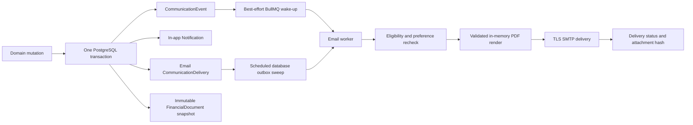

# Communications, Email, and Financial Documents

This document is the durable engineering and operations contract for
GuestPost.cc notifications, transactional email, user preferences, and PDF
financial-document attachments. Code remains the source of truth; the primary
catalog is `packages/shared/src/communications.ts` and the attachment policy is
`packages/shared/src/financial-documents.ts`.

## Architecture



The database, not Redis, is the delivery boundary. The domain mutation,
logical event, recipient deliveries, in-app notification, and any financial
document snapshot commit together. Queue publication only reduces latency. A
five-minute sweep recovers committed deliveries after queue or worker outages.

## Communication catalog and preferences

Every event must be declared in `COMMUNICATION_EVENT_TYPES` with a category,
severity, default channels, and deliberately narrow required-channel policy.
The API rejects unknown event types, unsafe action paths, oversized messages,
duplicate preference categories, and staff settings submitted by non-staff
users.

Customer, publisher, and staff settings support in-app and email control by
category. Required security, money-receipt, deadline, fraud, reconciliation,
and staff-risk channels override opt-outs. This exception must not be expanded
for marketing or product announcements.

Delivery fraud detection records a required `STAFF_FRAUD_ALERT` in the same
Order-locked transaction that appends the immutable fraud flag. The alert is
preference-resistant for staff risk recipients and contains only the order,
delivery, flag identity, and signal type. Investigation evidence and any
cross-order customer details remain in staff-authorized delivery evidence
surfaces. See `docs/DELIVERY_FRAUD_AND_MANUAL_VERIFICATION.md` for adjudication
and customer-denial behavior.

Recipient eligibility is evaluated twice: when the event commits and again
immediately before SMTP delivery. A deleted, banned, unverified, opted-out, or
suppressed recipient is not sent mail. Required messages still require an
eligible verified address.

## Email security and rendering

- Dynamic content is HTML-escaped and every message has a plain-text part.
- Action destinations are application-relative paths resolved against the
  audience's allowlisted application origin. Production origins must be HTTPS.
- SMTP uses TLS 1.2 or later, bounded connection and socket timeouts, a small
  connection pool, deterministic message IDs, and bounded exponential retries.
- Subjects reject CR/LF injection. Recipient addresses and optional staging
  domains are validated immediately before delivery.
- Logs contain delivery IDs, event types, recipient domains, and bounded
  redacted diagnostics - never full addresses, message bodies, provider
  payloads, invoice snapshots, or tax identifiers.
- SMTP 550, 551, and 553 responses create a hard-bounce suppression. Mailbox
  full and generic provider-policy errors remain retryable.
- `disabled`, `capture`, and `live` delivery modes are explicit. Staging should
  combine `capture` with `EMAIL_ALLOWED_RECIPIENT_DOMAINS`.

## PDF attachment policy

Only these customer financial events currently produce attachments:

| Event | Document | Purpose |
| --- | --- | --- |
| `ORDER_PAYMENT_CAPTURED` | Paid invoice | Records a completed wallet-funded service purchase |
| `ORDER_REFUNDED` | Credit note | Records the reversal and references the original invoice when available |
| `BILLING_DEPOSIT_SUCCEEDED` | Deposit receipt | Records funds received and the amount credited to the wallet |

Settlement and payout messages are not called invoices. They remain
transactional statements until their accounting, withholding, and
jurisdictional requirements are separately certified. Staff risk alerts never
receive customer accounting attachments.

Events created before attachment support remain deliverable without a PDF.
New events store only a `financialDocumentId` in the communication payload. If
that ID is present but malformed, missing, the wrong kind, or bound to another
aggregate or organization, delivery fails closed and retries. The worker never
accepts arbitrary filenames, HTML-to-PDF input, remote images, filesystem
paths, or attachment bytes from an event payload.

PDFs are generated in memory with bundled fonts and vector primitives. They
contain no JavaScript, forms, remote resources, embedded files, or external
links. The deterministic filename is the financial document number, and the
attachment is capped at 5 MiB. After SMTP acceptance, the delivery stores the
filename, byte size, and SHA-256 digest for forensic comparison without
retaining a second PDF copy.

## Accounting data and immutability

`BillingProfile` is mutable and owner-only. It contains the legal name,
billing email, postal address, country code, and optional paired tax-ID
type/value used for future documents. Reads and writes repeat active-owner
authorization inside the service even though the controller also uses role
guards. Audit entries record only the country and presence flags; addresses,
emails, and tax identifiers are excluded from audit metadata.

`FinancialDocument` is an issued accounting record. It receives a global
database sequence, snapshotted prefix, UTC issue time, exact decimal totals,
recipient and issuer snapshots, line items, payment reference, tax statement,
and optional original-document reference. A database trigger rejects UPDATE
and DELETE so later profile or environment changes cannot rewrite history.
Credit notes are new immutable records rather than edits to invoices.

Document numbers use:

```text
{PREFIX}-{INV|CRN|DPR}-{UTC YEAR}-{8-DIGIT GLOBAL SEQUENCE}
```

Database sequences may contain gaps after rolled-back transactions. Gaps are
normal and must not be "repaired" by renumbering issued documents.

All monetary comparisons are performed using exact decimal/minor-unit logic.
Rendering stops before SMTP if line totals, subtotal, tax, and total do not
reconcile. The current commerce model does not separately charge tax, so the
document truthfully shows a zero tax amount and states that tax was not
separately charged. Do not change PDF wording to introduce VAT/GST/sales tax;
tax calculation, evidence, registration, and ledger behavior must be built and
certified first.

The bundled deterministic font supports the Latin invoice character set.
Billing details outside that set are rejected at the settings boundary rather
than being silently replaced. International expansion must embed and test the
required licensed Unicode font subsets before relaxing this validation.

## Compliance boundary

These controls support accurate commercial records but do not establish
universal tax compliance. Before production launch, Finance or counsel must
confirm at least:

- the contracting entity, registered address, support mailbox, and tax
  registration identifiers;
- whether customer addresses or additional registration fields are mandatory
  in each served jurisdiction;
- invoice and credit-note numbering requirements;
- tax collection, exemption, reverse-charge, and rounding rules;
- record retention and data-subject deletion exceptions;
- whether publisher settlements or payouts require self-billing invoices,
  withholding certificates, or other statements.

Accounting records should be retained under the approved retention schedule.
Deleting an organization must not be used to erase issued financial documents;
the immutable snapshot intentionally has no destructive organization foreign
key.

## Configuration

Production financial events require all issuer fields below on both the API
and worker. Values are read by whichever process issues the event and saved
into the immutable snapshot:

```text
INVOICE_DOCUMENT_PREFIX
INVOICE_ISSUER_LEGAL_NAME
INVOICE_ISSUER_ADDRESS_LINE_1
INVOICE_ISSUER_ADDRESS_LINE_2        # optional
INVOICE_ISSUER_CITY
INVOICE_ISSUER_REGION                # optional
INVOICE_ISSUER_POSTAL_CODE
INVOICE_ISSUER_COUNTRY_CODE          # ISO alpha-2
INVOICE_ISSUER_TAX_ID_TYPE           # optional pair
INVOICE_ISSUER_TAX_ID                # optional pair
INVOICE_SUPPORT_EMAIL
```

If no issuer is configured outside production, documents receive a visible
`NON-PRODUCTION SAMPLE` watermark and development identity. Partially
configured issuer data is rejected in every environment.

SMTP and application-origin configuration is documented in `.env.example`.
Secrets belong in the deployment secret manager, never source control or
financial-document payloads.

## Release and migration order

1. Obtain approved issuer and tax wording from Finance or counsel.
2. Configure issuer values on the API and SMTP/origin values on the worker.
3. Apply `20260809180000_durable_communications` if not already applied.
4. Apply `20260810120000_financial_document_attachments` before deploying the
   new API or worker.
5. Deploy the API and worker from the same commit.
6. Keep mail in `capture` mode and restrict recipient domains.
7. Save a complete owner billing profile.
8. Exercise a deposit, paid order, and refund. Inspect both the email and PDF.
9. Confirm outbox retry, PDF hash/size persistence, hard-bounce suppression,
   and no sensitive values in logs or audit metadata.
10. Enable `live` only after the staged evidence is approved.

Rollback must stop new API/worker code before reverting schema assumptions.
Issued financial documents must not be deleted during rollback. If a document
is factually wrong, issue a credit note or an approved replacement workflow;
never disable the immutability trigger for ordinary correction.

## Adding a communication or attachment

1. Add the event and policy to the shared catalog.
2. Record it inside the domain transaction with a stable, input-bound dedup key.
3. Resolve recipients by active role/membership, never by unaudited email env
   lists.
4. Use an application-relative action path and exclude secrets and PII from the
   event payload.
5. Add preference and required-channel tests.
6. If the event needs an accounting attachment, obtain accounting approval,
   add exactly one mapping in `FINANCIAL_DOCUMENT_EVENT_POLICY`, build its
   immutable snapshot from canonical data, and add reconciliation tests.
7. Render representative one- and multi-page PDFs to PNG and inspect spacing,
   wrapping, totals, headers, footers, watermarking, and supported glyphs.
8. Run Prisma validation, affected typechecks, API/worker/shared/UI tests, and a
   clean migration replay before release.

## Operational triage

- `PENDING` or `FAILED`: inspect the bounded `lastError`, database availability,
  SMTP state, and the sweep schedule. Do not manually mark a delivery sent.
- `PROCESSING` beyond 15 minutes: the lease recovery path returns it to retry.
- `SUPPRESSED`: confirm account verification, current preferences, and active
  suppression rows.
- `BOUNCED`: correct and re-verify the account address before an authorized
  suppression reset.
- Attachment mismatch or reconciliation error: treat as an accounting/data
  integrity incident. Pause live email if repeated; do not bypass attachment
  validation to make the queue green.
- SMTP accepted but customer reports no message: use provider message ID,
  deterministic message ID, delivery ID, attachment SHA-256, and recipient
  domain. Never request the customer's tax ID or full PDF over an insecure
  support channel.
